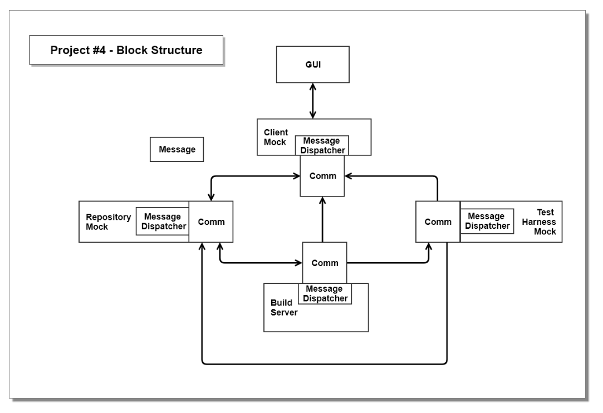

# Remote-Build-Server
Remote Build Server using C#

**Background Information:**

In order to successfully implement big systems we need to partition code into relatively small parts and thoroughly test each of the parts before inserting them into the software baseline2. As new parts are added to the baseline and as we make changes to fix latent errors or performance problems we will re-run test sequences for those parts and, perhaps, for the entire baseline. Because there are so many packages the only way to make this intensive testing practical is to automate the process.

The process, described above, supports continuous integration. That is, when new code is created for a system, we build and test it in the context of other code which it calls, and which call it. As soon as all the tests pass, we check in the code and it becomes part of the current baseline. There are several services necessary to efficiently support continuous integration.

A Federation of servers with each providing a dedicated service for continuous integration consists of:

**Repository:** Holds all code and documents for the current baseline, along with their dependency relationships. It also holds test results and may cache build images.

**Build Server:** Based on build requests and code sent from the Repository, the Build Server builds test libraries for submission to the Test Harness. On completion, if successful, the build server submits test libraries and test requests to the Test Harness, and sends build logs to the Repository.

**Test Harness:** Runs tests, concurrently for multiple users, based on test requests and libraries sent from the Build Server. Clients will checkin, to the Repository, code for testing, along with one or more test requests. The repository sends code and requests to the Build Server, where the code is built into libraries and the test requests and libraries are then sent to the Test Harness. The Test Harness executes tests, logs results, and submits results to the Repository. It also notifies the author of the tests of the results.

**Client:** The user's primary interface into the Federation, serves to submit code and test requests to the Repository. Later, it will be used view test results, stored in the repository.

